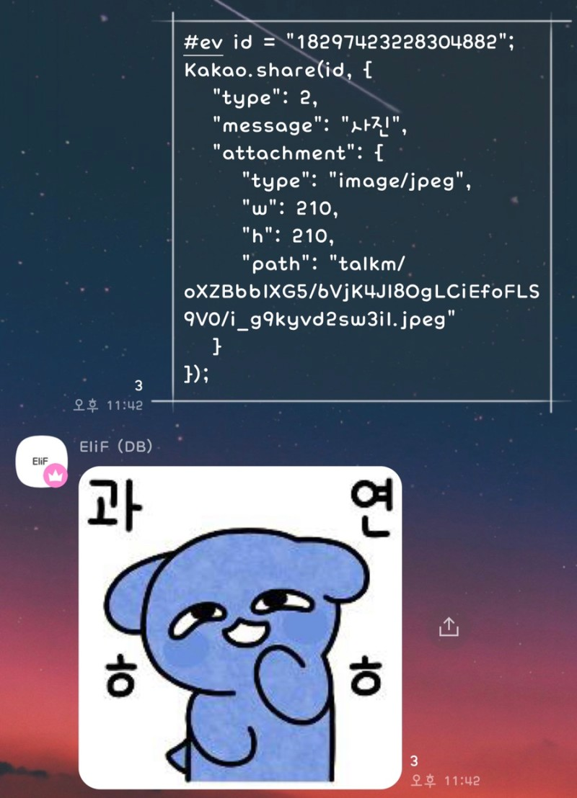

# shareKakao




> # Example
> ``` javascript
> const shareKakao = require("share");
> const Kakao = new shareKakao();
> Kakao.package("com.kakao.tall");
> ```
>
>
> > * Simple Text Share
> > ``` javascript
> > Kakao.share("chat_id", {
> >     "type": 1,
> >     "message": "example",
> >     "attachment": {}
> > });
> > ```
>
>
> > * Shout Text Share
> > ``` javascript
> > Kakao.share("chat_id", {
> >     "type": 1,
> >     "message": "example",
> >     "attachment": {
> >         "shout": true
> >     }
> > });
> > ```
