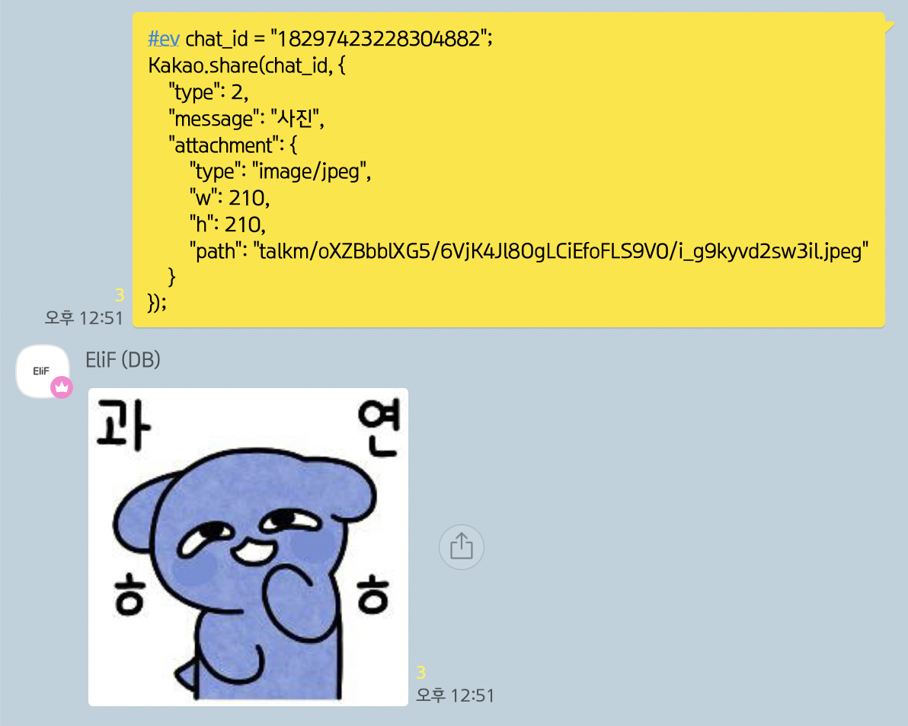
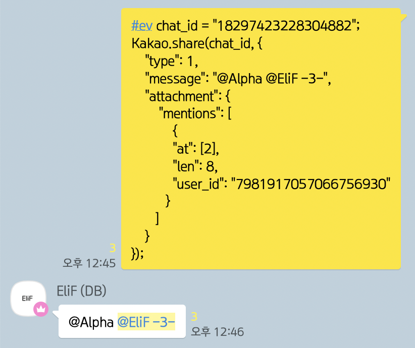
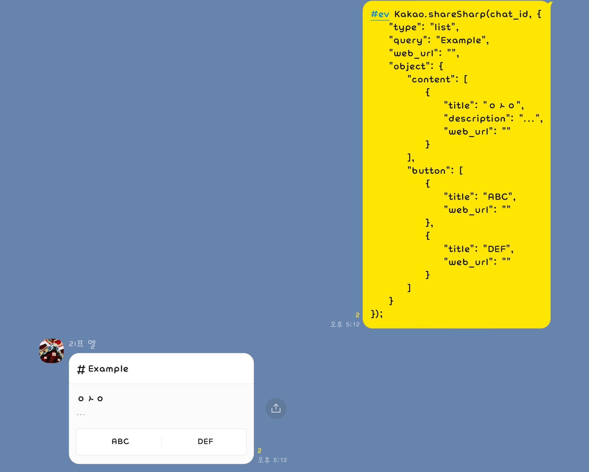

# shareKakao

* [Ko] 카카오톡 공유하기 모듈 (for Rhino)
* [En] Share Kakao Module (for Rhino)

[](https://developer.mozilla.org/en-US/docs/Mozilla/Projects/Rhino)
[](./LICENSE)

> 2021/04/18 `정상 작동`

* * *

# Warning
해당 모듈을 사용하여 얻는 모든 불이익에 대해 아무런 책임을 지지 않습니다.




* * *

# Example - Kakao.share()

> * Share Simple Text - [Type: 1]
> ``` javascript
> const shareKakao = require("share.js");
> const Kakao = new shareKakao();
> Kakao.package("com.kakao.talk");
>
> Kakao.share("chat_id", {
>     "type": 1,
>     "message": "example",
>     "attachment": {}
> });
>  ```
 
> * Share Shout Text - [Type: 1]
> ``` javascript
> const shareKakao = require("share.js");
> const Kakao = new shareKakao();
> Kakao.package("com.kakao.talk");
>
> Kakao.share("chat_id", {
>     "type": 1,
>     "message": "Example",
>     "attachment": {
>         "shout": true
>     }
> });
> ```

> * Share Mention Text - [Type: 1]
> ``` javascript
> const shareKakao = require("share.js");
> const Kakao = new shareKakao();
> Kakao.package("com.kakao.talk");
>
> Kakao.share("chat_id", {
>     "type": 1,
>     "message": "@Example",
>     "attachment": {
>         "mentions": [{
>             "at": [1],
>             "len": 8,
>             "user_id": "user_id"
>         }]
>     }
> });
>
> /*
> Kakao.share("chat_id", { 
>     "type": 1,
>     "message": "@", // 1. 닉네임 없이 @.
>     "attachment": {
>         "mentions": [{
>             "at": [1],
>             "len": 0, // 2. 닉네임 길이를 0.
>             "user_id": "user_id" // 1, 2번처럼 해두고 user_id만 넣으면 멘션 가능합니다.
>         }]
>     }
> });
> */
> ```

> * Share Long Text - [Type: 1]
> ``` javascript
> const shareKakao = require("share.js");
> const Kakao = new shareKakao();
> Kakao.package("com.kakao.talk");
>
> Kakao.share("chat_id", {
>     "type": 1,
>     "message": "Example", // 미리보기 텍스트.
>     "attachment": {
>         "type": "text/plain",
>         "mt": "text/txt",
>         "path": "path" /* talkm/bla/bla.txt */
>     }
> });
> ```

> * Share Simple Image - [Type: 2]
> ``` javascript
> const shareKakao = require("share.js");
> const Kakao = new shareKakao();
> Kakao.package("com.kakao.talk");
>
> Kakao.share("chat_id", {
>     "type": 2,
>     "message": "사진",
>     "attachment": {
>         "type": "image/jpeg",
>         "w": 210,
>         "h": 210,
>         "path": "path" /* talkm/bla/bla.jpeg */
>     }
> });
> ```

> * Share Simple File - [Type: 18]
> ``` javascript
> const shareKakao = require("share.js");
> const Kakao = new shareKakao();
> Kakao.package("com.kakao.talk");
>
> Kakao.share("chat_id", {
>     "type": 18,
>     "message": "Example",
>     "attachment": {
>         "name": "bla.zip", // 확장자 입력 필수.
>         "size": 1572864, // 바이트 기준, 1572864 입력시 출력 -> 1.5 MB
>         "path": "path" /* talkf/bla/bla.zip */
>     }
> });
> ```

# Available Types - Kakao.share()
> ``` javascript
> {
>     "text": 1,
>     "image": 2,
>     "video": 3,
>     "audio": 5,
>     "map": 16,
>     "file": 18
> }
> ```

* * *




# Example - Kakao.shareSharp()

> * Share Sharp Search - [Type: list]
> ``` javascript
> const shareKakao = require("share.js");
> const Kakao = new shareKakao();
> Kakao.package("com.kakao.talk");
> Kakao.myUserId("myUserId");
>
> Kakao.shareSharp("chat_id", {
>     "type": "list",
>     "query": "Example",
>     "web_url": "",
>     "object": {
>         "content": [
>             {
>                 "title": "ㅇㅅㅇ",
>                 "description": "...",
>                 "web_url": ""
>             }
>         ],
>         "button": [
>             {
>                 "title": "ABC",
>                 "web_url": ""
>             },
>             {
>                 "title": "DEF",
>                 "web_url": ""
>             }
>         ]
>     }
> });
>  ```

> * Share Sharp Search - [Type: image]
> ``` javascript
> const shareKakao = require("share.js");
> const Kakao = new shareKakao();
> Kakao.package("com.kakao.talk");
> Kakao.myUserId("myUserId");
> 
> Kakao.shareSharp("chat_id", {
>     "type": "image",
>     "query": "Example",
>     "web_url": "",
>     "object": {
>         "content": [
>             {
>                 "image_url": "http://blabla.com/abc.jpg",
>                 "width": "500",
>                 "height": "400",
>                 "web_url": ""
>             }
>         ],
>         "button": []
>     }
> });
>  ```

# Available Types - Kakao.shareSharp()
> ``` javascript
> [
>     "feed",
>     "list",
>     "image",
>     "media"
> ]
> ```
